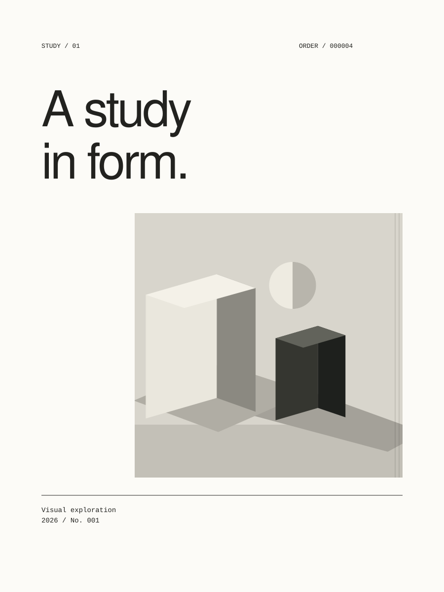

# STUDY/01

A local composition instrument for exploring three visual systems with one image, a title, and metadata. The interface is built with Vite, React, TypeScript, and CSS. The composition engine is plain TypeScript and does not import React or browser APIs.

Source: [github.com/notlestat/study-01](https://github.com/notlestat/study-01)

**Current version: v0.2.0 (Stage 12 integrated).** This is an experimental local-first build, not a finished creative-quality benchmark. It includes ORDER, SILENCE, and TENSION generators, seed-based variation, selective mutation locks, PROOF contact sheets, DIRECT transformations, ACCIDENT, typographic material treatments and image/type relationships, SPACE exclusion zones, PASS material processing, visual lineage and crossbreeding, FAMILY recomposition, DRIFT motion studies, image-derived colour systems, a research archive, local session recovery, and PNG/SVG/contact-sheet/family/WebM export.



The [frozen 18-study baseline](public/benchmarks/baseline/index.html), [current 18-study sheet](public/benchmarks/current/index.html), [DIRECT operation review](public/benchmarks/direct/index.html), [SPACE constraint review](public/benchmarks/space/index.html), [image/type review](public/benchmarks/image-type/index.html), [crossbreed review](public/benchmarks/crossbreed/index.html), [ACCIDENT review](public/benchmarks/accident/index.html), [typography review](public/benchmarks/typography/index.html), [FAMILY review](public/benchmarks/family/index.html), [DRIFT frame review](public/benchmarks/drift/index.html), and [COLOUR review](public/benchmarks/colour/index.html) make visual changes inspectable. Source material is held constant within each review. The colour sheet uses a clearly labelled recoloured geometric fixture. The frozen baseline is never overwritten.

## Run

Node 26.8.1 is the verified development runtime. The tests import TypeScript directly through Node's native support, so older Node versions may need an upgrade. No API key or backend is needed.

```sh
git clone https://github.com/notlestat/study-01.git
cd study-01
npm ci
npm run dev
```

Open the local address printed by Vite. From the repository root, run these checks. Build before previewing:

```sh
npm run typecheck
npm test
npm run build
npm run preview
```

## Workspaces

Five workspaces share one document:

| Workspace | Instruments |
| --- | --- |
| COMPOSE | Composition, PROOF contact sheets |
| DIRECT | Creative operations, Image × Type, Type Material, SPACE |
| DEVELOP | PROCESS / PASS, GENETICS, CROSSBREED, FAMILY, DRIFT, COLOUR |
| ARCHIVE | Saved studies, filters, comparison, branching, contact sheets |
| OUTPUT | Still export, resolution, transparency |

## Try it

1. Start with the built-in image or choose a PNG, JPEG, WebP, or AVIF file under 20 MB. Local files stay in your browser.
2. Edit the title and metadata, choose ORDER, SILENCE, or TENSION, and press **Generate**. The current paper stays visible while you edit; Generate applies the draft.
3. Change the seed to reproduce or explore a result. **Next seed** generates a fresh composition at the next seed.
4. Toggle any locks, then press **Mutate**. Mutation searches for a new seed while preserving the locked parts and avoiding title/image collisions. It is unavailable while draft inputs differ from the current paper or when all four parts are locked.
5. Open **Compose → Proof** to generate a 4, 9, 12, or 16-study contact sheet. Select studies to compare; Keep saves one, Reject removes it from the active sheet, and Develop brings it into Compose as a new parent.
6. Open **Direct** and choose **Operations**, **Image × Type**, or **Type Material**. Operations offer WITHHOLD, FRACTURE, COMPRESS, INTERRUPT, ECHO, ERODE, DISPLACE, INVERT, and ACCIDENT. ACCIDENT has four severities and behaves differently in ORDER, SILENCE, and TENSION. Image × Type offers masking, knockout, slicing, overprint, occlusion, displacement, and EXTRACT STRUCTURE. Type Material offers ten character and vector-mask treatments with a readability control. Set intensity and seed, preview, then Apply. Undo, Redo, and Reset work on document snapshots. Active locks constrain these methods.
7. For **EXTRACT STRUCTURE**, upload a photograph and press Generate first. The browser reads a 64×64 sample locally to estimate contrast, detail, focal weight, and quieter regions. This guides its crop, title placement, tone, and grid density. The built-in geometric sample has no analysis, so this mode stays disabled for it.
8. Open **Direct → Space** and drag on the paper to define an exclusion zone. Choose rectangle, ellipse, or freeform, adjust its coordinates, lock or remove it, then Recompose. Zones guide later mutation and proof studies. Their editing outlines are omitted from export.
9. Open **Develop → Process** to build a PASS stack. Choose from RAW, THRESHOLD, DITHER, HALFTONE, XEROX, BITMAP, OFFSET, EROSION, SCANNER DISPLACEMENT, GRAIN, INK BLEED, and CHANNEL MISREGISTRATION. Passes can be reordered, disabled, edited, and saved as local presets. The stage control previews earlier results; Compare original temporarily shows the source photograph. Apply commits the viewed stage, while Restore original removes the processing from the current composition.
10. Open **Develop → Genetics** to see the current study, its session history, and saved variations as a generation tree. Select an earlier study and **Develop this direction** to branch from it. Select two circle controls to compare parents and preview a hybrid. Parent A supplies the image and grid; parent B supplies the type relationship. Adjust type influence, then press **Crossbreed studies**. The hybrid records both parents and the weighting.
11. Open **Develop → Family** and generate seven related assets: poster, square, editorial, banner, social portrait, type only, and image only. Each format has its own composition and dimensions. Select one to export as PNG or SVG, or download all seven embedded-image SVGs as a ZIP. **Develop selected** moves that format into Compose for further mutation, saving, and export.
12. Open **Develop → Drift** to choose SLIP, DECAY, or REPEAT. Set duration, speed, intensity, spatial direction, loop, and seed; play, pause, scrub, or reset. **Attach motion to study** stores the recipe with the document. **Export WebM** records the animated composition in compatible browsers. Browser recording timing can vary, especially in a background tab.
13. Press **Save variation** to keep a snapshot in this browser. Select a thumbnail to restore it, including a locally chosen image and its PASS source. Saved variations survive reload. The current paper, images, draft inputs, locks, and undo/redo history bounded to 40 snapshots in each direction recover locally after reload. Wait for “Session saved locally” before closing; changes made immediately before a forced close may not reach storage. Unapplied previews and proof/family sheets remain temporary. Save parent studies if you want their artwork available for comparison after reload; a saved child still remembers parent IDs even when the parents are unavailable.
14. Open **Output** for PNG at 1×, 2×, or 3× document size, or native-size SVG. Dimensions are shown before export. Transparent paper removes the background; paper-coloured erasure/knockout marks remain. SVG embeds imagery and study metadata. Guides and selection indicators are omitted.

15. Open **Develop → Colour** to constrain the artwork to monochrome, duotone, tritone, an extracted palette, or separated inks. Palette extraction stays local; the built-in sample uses a restrained fallback palette.
16. Open **Archive** to filter by system, date, or operation. Select two studies to compare, then reopen, branch, duplicate, or delete. Contact-sheet export includes all visible filtered studies and paginates into a ZIP beyond 12 artworks. PROOF also exports its active or comparison sheet.

**Commands and keyboard:** ⌘/Ctrl K opens command search. G generates, M mutates, F toggles focus, Escape exits focus, +/− changes zoom, and 0 fits the canvas. ⌘/Ctrl S saves a variation; ⌘/Ctrl Z and ⌘/Ctrl Shift Z undo/redo. Text fields keep their normal editing shortcuts. Compose has native fullscreen, safe-area/grid overlays, before/after comparison, and element inspection.

Saved variations live in this browser's IndexedDB. They are not part of the GitHub repository and will not appear on another device. Clearing this site's browser data removes them; export a composition you want to keep outside the browser.

**Generate** and **Next seed** create a fresh document from the source, system, and seed. Locks constrain mutation and experimental operations. Generate deliberately starts a fresh composition:

| Lock | Preserved during mutation |
| --- | --- |
| GRID | Element positions, sizes, and rule endpoints |
| TYPE | Title and metadata text, typography, and boxes |
| IMAGE | Image frame, fit, and crop position |
| TEXTURE | Pattern, pitch, opacity, and placement |

The seed and edition annotations still update when TYPE is locked. Some combinations require the engine to skip seeds until the fixed parts leave a clear arrangement. If all parts are locked, mutation, proof, and direct transformation are unavailable.

## Architecture

```text
src/domain/       Shared input, document, and element types
src/engine/       Pure, deterministic systems, mutation, proof, operations, genetics, and image analysis
src/processing/   Pure pixel transformations and the PASS Web Worker
src/lib/          Image decoding, archive/recovery storage, portable exports, ZIP
src/app/          React session hook and panel wiring
src/components/   Controls, canvas renderer, shell, and variations rail
src/styles/       Design tokens and responsive CSS
```

The document stores concrete geometry. Its `version` describes the storage schema; `engineRevision` separately records the generation code revision. Seeds reproduce artwork within that revision. Older saved artwork is rendered from its stored geometry, without substituting newer generation rules.

The engine returns a `CompositionDocument` in a 900×1200 coordinate space for the three base systems; FAMILY documents use their own format dimensions. SVG uses its `viewBox` to scale the same document for the large canvas, saved thumbnails, and export. No generator measures the browser window or changes the supplied input. Text width uses conservative estimates, so exact shaping can vary with the installed fonts.

The document's `kind` field is a TypeScript discriminant: a renderer can safely handle a text, image, rule, or texture element according to its properties. `SystemId` and `LockKey` are unions derived from constant arrays, so invalid names are caught during type checking. The React hook holds a draft session and a generated document separately; a controlled textarea updates the draft, while Generate creates a new snapshot. `useRef` holds the SVG element for export and tracks temporary image URLs without triggering a render. `useEffect` releases those URLs when no draft, paper, or saved thumbnail uses them.

IndexedDB stores each saved document plus Blobs for a local image and its unprocessed original. A separate, versioned recovery database holds the active session and bounded history, deduplicating repeated image sources. Existing archive records keep their original schema; missing lineage is hydrated as a stable legacy root. Restoring creates a new temporary URL for that Blob. SVG export embeds image bytes as a data URL, which makes the file portable without depending on the temporary browser URL. Exported text remains editable SVG text, so recipients may see a fallback font if their system lacks the font used in the preview.

## Development checks

`npm test` runs pure engine tests in Node. They check reproducibility, variation across seeds, paper bounds, text fitting, collision avoidance, proof generation, operation serialisation, exclusion geometry, pixel analysis, image/type relationships, pass determinism and ordering, genetic inheritance, typographic geometry, and preservation under locks. `npm run build` includes strict TypeScript checking and a production Vite build. `npm run benchmark:current` recreates the comparison sheet without overwriting the frozen baseline; the other `benchmark:*` scripts recreate the feature review sheets.

The current checks pass 51 Node tests and six browser export cases. With Vite running, open `/scripts/verify-export.html` and choose **Run export checks** to verify production SVG embedding/metadata/guides, PNG dimensions, transparency, fragmented imagery, colour filters, vector type masks, and landscape output. This development tool is omitted from the production build. Mobile Compose, DRIFT, navigation, and command search were checked at 390 px. Recovery, undo/redo, archive duplication/filtering, and worker-backed PASS previews were also exercised in the browser.

## Known limits

- Some embedded browsers block native fullscreen. STUDY falls back to its panel-free Focus view.
- WebM uses browser capture timing. Duration and frame rate can vary, particularly in background tabs. MP4/GIF export is not included.
- SVG retains editable system-font text rather than bundled glyph outlines. Font substitution and non-Latin shaping need further review.
- PASS processes at a maximum 1400 px image side. Larger PNG export cannot recover source detail removed during processing.
- FAMILY recomposes the system, crop, colour, processing, image/type recipe, and last type-material recipe. It does not replay every DIRECT operation or SPACE zone across formats. Type-only/image-only outputs omit incompatible image/type relationships.
- Crossbreeding remains biased toward the base image/grid. Family formats can feel formulaic with the sample. The visual reviews document these weaknesses; control count does not establish artwork quality.
- Recovery and archive are local to the browser origin. Changing ports or clearing site storage changes access to the studies. Simultaneous tabs share one recovery record; the latest write wins. Save important directions and export external records.
- Undo history is bounded to 40 snapshots. A saved child remembers parent IDs even when older parent artworks are unavailable. Unapplied previews and generated sheets are not autosaved.
- The colour benchmark uses geometric material. The photographic PASS review covered a dark image; lighter photographs, portraits, and more varied art-directed inputs remain a quality review task.

See [DEVELOPMENT.md](DEVELOPMENT.md) for architecture, implementation evidence, and visual decisions.

## AI-assisted development

Corey sets the art direction and selects the work. Codex implements the engine and interface, creates repeatable review sheets, and checks behaviour against the brief. The frozen benchmark makes changes inspectable. Diversity counts are clues; type relationships, crop decisions, and material character need visual judgment. DEVELOPMENT.md explains the React/TypeScript boundaries used by the application.

## GitHub updates

The public repository tracks `origin/main`. To publish changes to the source code:

```sh
git status
git add .
git commit -m "Describe your update"
git push
```
